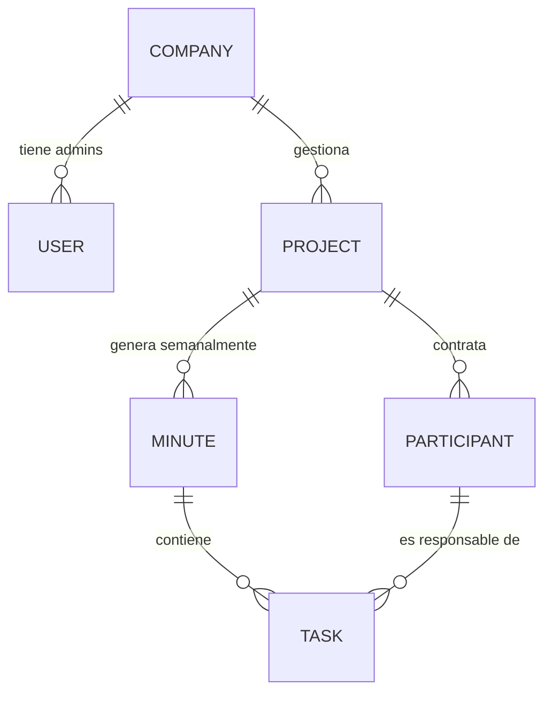

# Estructura del Proyecto y Lógica de Negocio

Este documento describe la estructura conceptual y el flujo de trabajo de **K-Tracker**, basado en los requerimientos del negocio.

## Entidades Principales

### 1. Empresa (Company)
-   **Registro**: Una empresa se registra en el sistema junto con un usuario inicial (Administrador).
-   **Rol**: La empresa es la entidad dueña de los proyectos.
-   **Datos**: Nombre, RUC, Dirección, Teléfono, etc.

### 2. Proyecto (Project)
-   **Gestión**: El administrador de la empresa crea y gestiona los proyectos.
-   **Contexto**: Generalmente representa una "Obra" de construcción o ingeniería.
-   **Recursos**: Cada proyecto tiene asignados recursos humanos (Participantes).

### 3. Recursos Humanos / Participantes (Participants)
-   **Contratación**: Se "contratan" o asignan a un proyecto específico.
-   **Almacenamiento**: Quedan registrados en la base de datos vinculados al proyecto/empresa.
-   **Rol**: Son los responsables de ejecutar las tareas asignadas en las actas.

### 4. Actas (Minutes)
-   **Generación**: Se generan manualmente de manera semanal dentro de cada proyecto.
-   **Contenido**: Agrupan un conjunto de tareas y acuerdos discutidos en la reunión semanal.
-   **Función**: Sirven como hito de control y seguimiento del avance de la obra.

### 5. Tareas (Tasks)
-   **Asignación**: Cada tarea dentro de un acta se asigna a un **Participante**.
-   **Multiplicidad**: Un participante puede tener múltiples tareas asignadas.
-   **Gestión**:
    -   El **Participante** gestiona el estado de sus propias tareas.
    -   El **Administrador** supervisa el avance global a través del proyecto.
-   **Flujo de Tareas (Carry-over)**:
    -   Toda tarea que **no esté finalizada** al momento de crear una nueva acta, se **traslada automáticamente** a la siguiente acta.
    -   Esto asegura que nada quede olvidado y se mantenga el seguimiento hasta su conclusión.

## Flujo de Trabajo Típico

1.  **Inicio**: La Empresa se registra y crea un Proyecto (Obra).
2.  **Configuración**: El Administrador da de alta a los Participantes (Recursos Humanos) del proyecto.
3.  **Reunión Semanal**:
    -   Se crea una nueva **Acta**.
    -   Se registran nuevas **Tareas** y se asignan a los Participantes.
    -   El sistema verifica tareas pendientes de actas anteriores y las mueve a la nueva acta.
4.  **Ejecución**:
    -   Los Participantes acceden al sistema para ver y actualizar el estado de sus tareas.
5.  **Seguimiento**:
    -   El Administrador monitorea el cumplimiento a través del Dashboard del proyecto.
    -   El ciclo se repite con la siguiente reunión semanal.

## Modelo de Datos (Simplificado)

